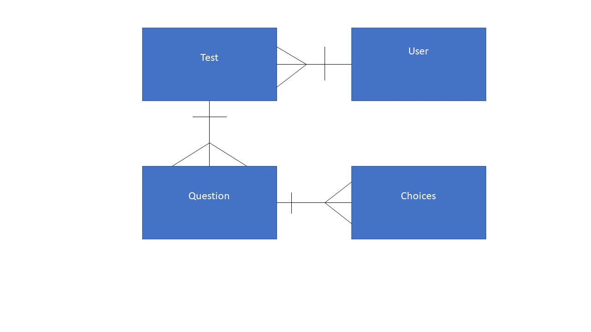
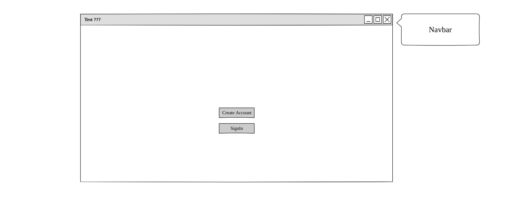
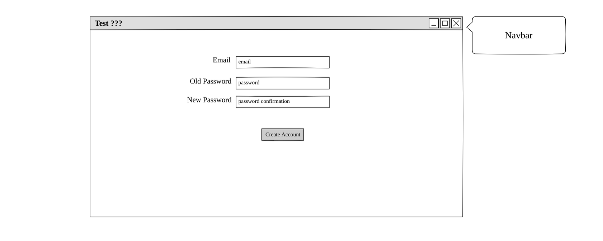
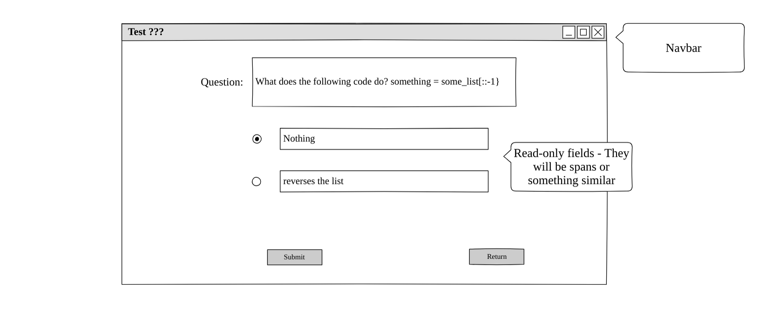
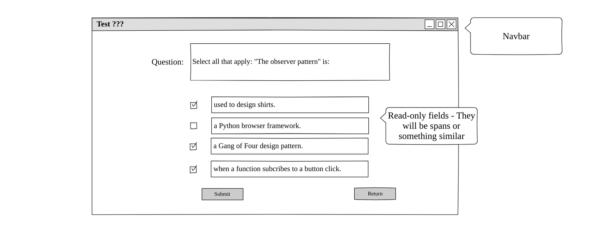

# Testprep

## Links
  [Deployed Frontend](https:/scottlurowist.github.io/testprep-frontend/#/)  
  [Deployed Backend](https://testprep-backend.herokuapp.com/)  
  [Frontend Github Repository](https://github.com/scottlurowist/testprep-frontend) 
  [Backend Github Repository](https://github.com/scottlurowist/testprep-backend)

***

This project represents the backend for a full stack application built upon the MERN stack. It is a
generic testing app that can be used to create and take tests for interview prep, self-study,
test preparation, or fun.

When the user signs into the app, they land on the Take A Test view. Here they can see all tests created by all
authors. They can select a test to take and take it.

The "My Tests" link brings the user to a view that lists all the tests that the user has authored. The tests
are organized by cards. The user can delete or edit tests by clicking the appropritate button within a given test
card. If the user has yet to create tests, they will see a card that allows them to create a test. This card is
always present regardless the number of cards.

In the edit view, the user can always save their progress by clicking the "Submit" button. It works just as
if you were editing a document with any office-style application. For this reason, input fields do not 
clear on save.

With the initial version of the app, you cannot order the questions. Questions are always presented in the order
in which they are created. When you select the "Add Question" button, that question is appended to the 
end of the list of questions. When you delete a question, the question is deleted in place.

The initial version of the app also limits you to 4 choices for a given question. You can currently select
the options for "select best" or "select all that apply". Changing these radio buttons changes whether 
the choices have radio buttons or checkboxes as appropriate. Due to time constraints, this version of the app
forces you to leave blank input fields if there are to be lesson than 4 choices.

When taking tests, you will be presented with a list of tests that have at minimum one question and at least 
two choices.

***

## Planning Story

The first step in the process of planning the site was to identify the functionality of the site based on
requirements and the user stories.  I created an ERD for the backend, and wireframes for the front end.
I then developed a few routes but abandoned cURL scripts for Postman as I have been using Postman for
years and I think it is a superior tool.

I also designed the database schema. Because I have been using SQL for two decades, my first inclintation
was to nomralize the database. But I realized that the data did not need to be normalized and fit into
the noSQL way of thinking.

A test has a name and a description and an owner. A test has zero or more questions, and each question has 
a type that determines whether the question is a "select best" or a "Select all that apply". Each question
has 4 choices. Each choice has a text property for the choice, and a boolean "isCorrect" property that indicates
whether that choice is correct. 

Therefore the Mongoose.js schema is a nested schema.

I created 6 routes for test CRUD operation as described in the table `API End Points`.

I was required to reduce the scope of the front end because I was sick for nearly two days of the project.

I first created the basic "views" which I consider to be "pages" in an SPA. I consider this something like
"roughing a house".

I worked on the TakeTest view first and had that working. The bulk of the work was in the edit test view.
There is very complicated state management, in particular because React.js does not like nested state.
So I had to take nested MongoDB data and "flatten it" to state suitable for React.js. I had to do the 
reverse on persisting tests back to MongoDB. The navigation buttons, and add and delete button enable and
disable for the appropriate situations. 

I finally did an inital deployment to make sure that works and it was flawless. Afterwords, I tried
to implement as much as I could to make the final due date. Styling was my lowest priority due to
the time I lost due to illness.

***

## Installation
1. Clone the repository: [Backend Github Repository](https://github.com/scottlurowist/testprep-backend)
2. In the root directory of the backend project, type `npm i` or `yarn install`.
3. Type the following in the same root directory: `npm start` to start the server.
4. Clone the repository: [Backend Github Repository](https://github.com/scottlurowist/testprep-frontend)
5. In the root directory of the backend project, type `npm i`.
6. Type the following in the same root directory: `npm start` to start the server.

***

## API End Points

| Verb   | URI Pattern                    | Controller#Action            |
|--------|--------------------------------|------------------------------|
| POST   | `/sign-up`                     | `users#signup`               |
| POST   | `/sign-in`                     | `users#signin`               |
| DELETE | `/sign-out`                    | `users#signout`              |
| PATCH  | `/change-password`             | `users#changepw`             |
| GET*   | `/tests`                       | `tests#index`                |
| GET**  | `/tests/:testid`               | `tests#single test`          |
| GET*** | `/tests/mytests/:email`        | `tests#get all owned tests`  |
| POST   | `/tests`                       | `tests#create`               |
| PATCH  | `/tests/:id`                   | `tests#update a test`        |
| DELETE | `/tests/:id`                   | `tests#delete a test`        |

  * GET*   - Retrieves all tests by all authors.
  * GET**  - Retrieves only tests authored by the authenticated user. 
  * GET*** - Get all tests by author email. 

All data returned from API actions is formatted as JSON.

***

## User stories
    * As a User I want to sign up so that I may create, update, delete, and take tests.
    * As a User I want to sign in once I have created an account so that I may create,
      update, delete, and take tests.
    * As a signed in User I want to change my password so that I can ensure that my account
      is secure.
    * As a signed in User I want to sign out from the app so that my session is closed.
    * As a signed in User I want to create a new test.
    * As a signed in User I want to update a test that I own.
    * As a signed in User I want to delete a test that I own.
    * As a signed in User I want to take tests created by any test author.

***

## Technologies Used
    1. HTML / CSS / SCSS
    2. Bootstrap
    3. JavaScript
    4. React.js / React DOM Router / React Boostrap
    5. Node.js
    6. Express.js
    7. Mongoose.js
    8. MongoDB
    9. Passport JS
    10. Bcrypt

***

## Unsolved Problems
  - I did not have any unsolved problems.

***

## Nice-to-haves / Technical Debt
    * Eliminate magic numbers and strings.
    * Massive refactoring. I lost a lot of time due to my illness, and there is a lot of
      code bloat that should not be. This is particularly true in EditTestView.jsx.
      It is too big.
    * Create more components. This is also an artifact of my illness.  
    * Add the ability for user's to contact the user if they disagree with a question
      and its choices.
    * Improve the styling dramatically. I am never satisfied with styling.
    * Group tests by topic.
    * Be able to rearrange test question order.
    * Create a more dramatic end to a test.
    * My list is long...  
      
***

## ERD 

*** 

## Wireframes

                    
