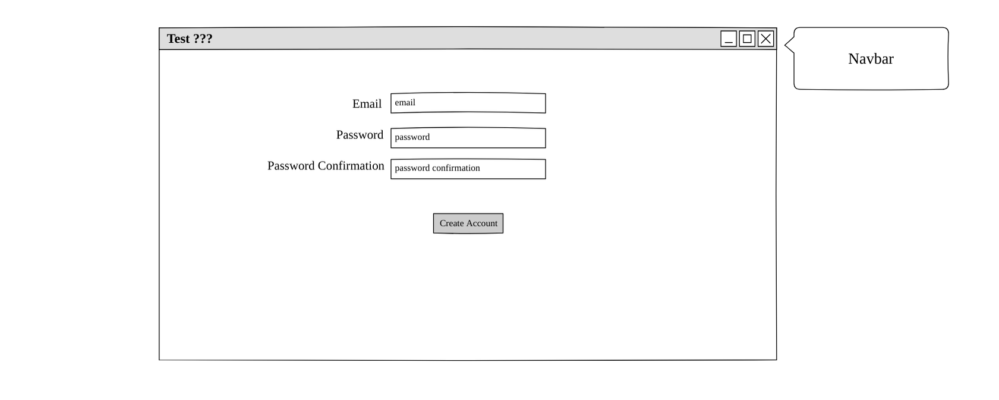

# Testprep: Description

Free, royalty images found on Bing:

This application allows a user to create, update, delete, and view
tests that they can use for any purpose; interview prep, language study,
self fulfillment, etc. 

The Testprep web application consumes web services from a backend project completed 
simultaneoulsy with this project. Its source code may be found here:
[Testprep web API Github link](https://github.com/scottlurowist/testprep-backend)

The application has a web-based front end that communicates with 
a backend web API implemented with Express.js, Mongoose.js, MongoDB, and of 
course Node.js. I implemented the backend. It is deployed to Heroku.

In the initial first version, 

## Planning Story

My initial work was to read and understand the project requirements.

I then used the Pencil wireframing application to create the wireframes seen
later in this document. I also generated the initial user stories.

***

### User Stories

* As a User I want to sign up so that I may create, update, delete, and take tests.
* As a User I want to sign in once I have created an account so that I may create,
  update, delete, and take tests.
* As a signed in User I want to change my password so that I can ensure that my account
  is secure.
* As a signed in User I want to sign out from the app so that my session is closed.
* As a signed in User I want to create a new test.
* As a signed in User I want to update a test that I own.
* As a signed in User I want to delete a test that I own.
* As a signed in User I want to take tests created by any test author.

***

### Technologies Directly Used

* HTML / JSX / CSS / SCSS
* JavaScript
* React.js / React Router DOM / React Bootstrap
* Bootstrap 4 (forms, buttons, color themes)
* NPM / Webpack

***

### Unsolved Problems

- I have no unsolved problems based upon the requirements given to me.

***

### Nice-to-haves / Technical Debt
* Improve the styling.
* Create automated Jest tests.
* Eliminate magic numbers and strings.

***

#### Wireframes:

